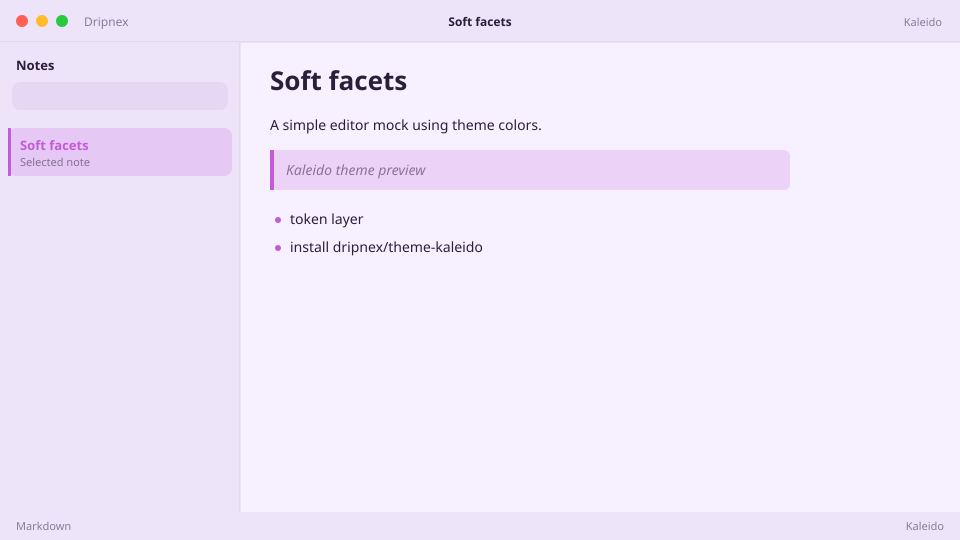

# Kaleido

Kaleidoscope paper. Soft rainbow good vibes.



```
dripnex/theme-kaleido
```

## Palette

The chips live in [palette.html](palette.html) — open it in a browser. GitHub won’t paint HTML swatches here, so the hex list is below.

| Name | Token | Color | What it’s for |
| --- | --- | --- | --- |
| Base | `--bg-base` | `#f7f0ff` | Window background |
| Surface | `--bg-surface` | `#eee4fa` | Sidebar and chrome |
| Elevated | `--bg-elevated` | `#fcf8ff` | Raised panels |
| Text | `--text-primary` | `#2a1f3a` | Headings and body |
| Muted | `--text-muted` | `#2a1f3a · rgba(42, 31, 58, 0.52)` | Secondary copy |
| Accent | `--accent` | `#c45ad8` | Selection and links |
| Active | `--status-active` | `#c45ad8` | Active status |
| Dropped | `--status-dropped` | `#c45a5a` | Dropped status |

Pick it when you want soft rainbow paper. Good vibes only.
